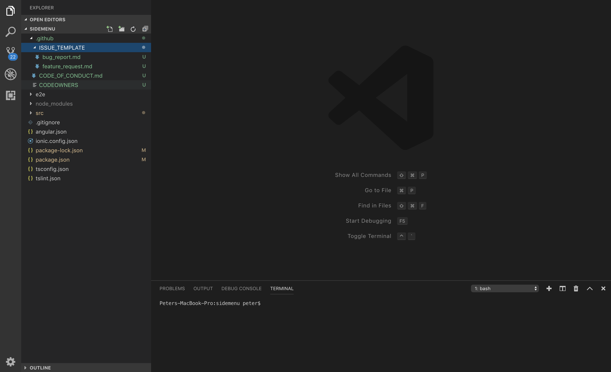

# GITHUB FOLDER

## Automatically generate the .github folder

---

## Installation

You can either install it from vscode or from the following link:

https://marketplace.visualstudio.com/items?itemName=PeterHdd.github-folder

## Information & Community Health Files For **YOUR-ORGANIZATION/YOUR-REPO**.

This vscode extension / repo will automatically create a .github folder that will
contain / host the [code of conduct][coc], a guide on how to get [support][] & How to [contribute][].

<!-- TLDR | a [pull request template][pr], and [issue templates][issue]. -->

**Note:** Don't forget to add your username to the specific files.

## Code of conduct

This project has a [code of conduct][coc].
By interacting with this repository, organization, or community you agree to abide by its terms.

## Support

We’re glad you’re using these projects and we’d love to help.
Take a moment to read [`support.md`][support] to find out how to help us help you..

## Contributing Support

We’re excited that you’re interested in contributing!
Take a moment to read [`contributing.md`][contribute] to find out how to help us help you..

## License

[developer_terms][license] © [YOUR-ORGANIZATION][author]

## Usage

Right click on the explorer space and choose _Create .github folder_

<!-- Definitions -->

[license]: https://example.com
[author]: https://example.com
[coc]: coc.md
[contribute]: contributing.md
[support]: support.md
[pr]: .github/pull-request-template.md
[issue]: .github/ISSUE_TEMPLATE
